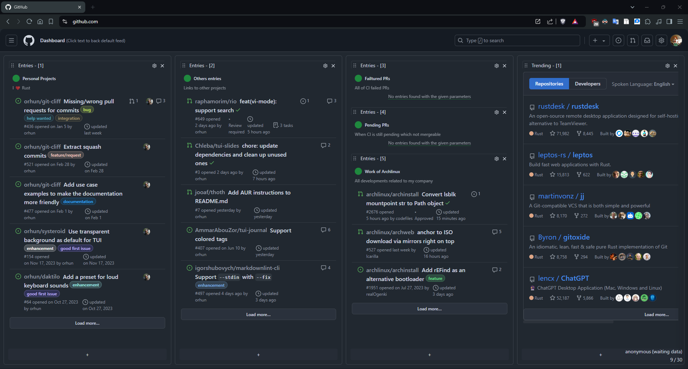
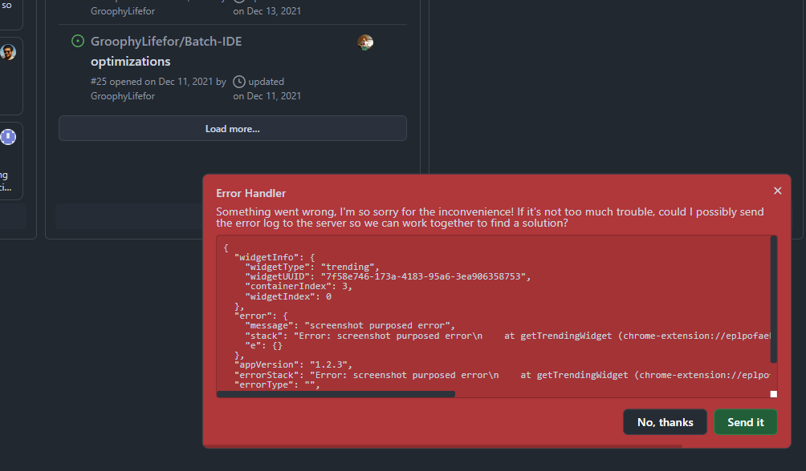
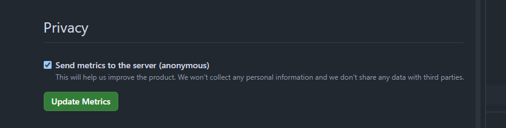
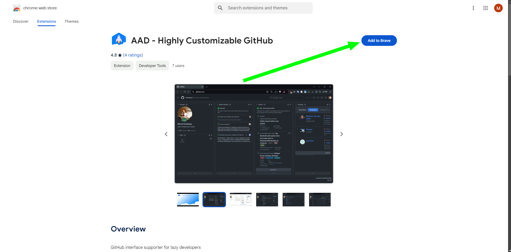

<h1 align="center">
   
  
   
  AAD - Highly Customizable GitHub
   
</h1>

<h6 align="center">
  AAD is a highly customizable GitHub extension that allows you to customize your GitHub experience.
</h6>

  

  <a href="#key-features">Key Features</a> •
  <a href="#how-to-use">How To Use</a> •
  <a href="#credits">Credits</a> •
  <a href="#related">Related</a> •
  <a href="#license">License</a>

     <table cellpadding="1" width="80%">
       <tr align="center">
       </tr>
       <tr align="center">
           <td style="border:none;vertical-align:middle;"> </td>
          </tr>
     </table>

## Key Features

---
##### Core feature of the product

 - **Privacy**: Collectable things are just two:
 - - Exception logs: If the extension encounters an error, I will handle it and send you a notification to send the exception data to the server.  `(Exception --> Ask client to send --if okay--> Send to server)`

     <table cellpadding="1" width="80%">
       <tr align="center">
       </tr>
       <tr align="center">
           <td style="border:none;vertical-align:middle;"> </td>
          </tr>
     </table>

 - - Metrics: I collect some metrics to improve the product, able to disable via settings and all metrics are open.  `(Metrics --if allowed--> Send to server)`

     <table cellpadding="1" width="80%">
       <tr align="center">
       </tr>
       <tr align="center">
           <td style="border:none;vertical-align:middle;"> </td>
          </tr>
     </table>

---

 - **Layout Customization**: Change container count, drag and drop widget position, add new widgets, remove widgets, change height types of Container, and more. 
 - **Responsive Design**: AAD is designed to work on all devices, from mobile to desktop.
 - **Stability focused product**: AAD is a highly stable product that is designed to work with GitHub, and don't have any AI feature.
 - **Focus one thing with preview**: AAD is designed to focus on one thing at a time, and you can preview the pull request, issue, repository, followers, followings, notifications, and more, but just one thing at a time with blurred background.

## How To Use (With installation)

Go to the [AAD Web Store](https://chromewebstore.google.com/detail/aad-highly-customizable-g/mgcjpifcmjkabdlpgbiahcdhknjjdmff) and install it.

     <table cellpadding="1" width="80%">
       <tr align="center">
       </tr>
       <tr align="center">
           <td style="border:none;vertical-align:middle;"> </td>
          </tr>
     </table>

Then, just open <a href="https://www.github.com" target="_blank">GitHub</a> to boostrap the extension. 

## Emailware

AAD is an [emailware](https://en.wiktionary.org/wiki/emailware). Meaning, if you liked using this app or it has helped you in any way, I'd like you send me an email at <muratkirazkaya0@gmail.com> about anything you'd want to say about this software. I'd really appreciate it!

## Credits

This software uses the following open source packages:

#### Extension

- Pure Javascript

#### Website

- [Next.js](https://nextjs.org/)
- [React](https://reactjs.org/)
- [Vercel](https://vercel.com/)
- [Tailwind CSS](https://tailwindcss.com/)
- [Headless UI](https://headlessui.com/)
- [Heroicons](https://heroicons.com/)
- [React Icons](https://react-icons.github.io/react-icons/)

#### Back-end

- [Next.js API](https://nextjs.org/)
- [Node.js](https://nodejs.org/)
- [MongoDB](https://www.mongodb.com/)

`Cost: 0$/Month`

> **Note:** Also one more back-end which for cron jobs

- [Go](https://golang.org/)
- [Railway](https://railway.app/)
- [MongoDB](https://www.mongodb.com/)

`Cost: 0.02$/Month`

## Support

#### TODO

## You may also like...

- [GitHub Refined](https://github.com/refined-github/refined-github) - Browser extension that simplifies the GitHub interface and adds useful features
- [Graphite](https://graphite.dev/) - Graphite is a productivity tool for efficient code reviews, integrated with GitHub and VS Code.

## License

MIT

---

> GitHub [@GroophyLifefor](https://github.com/GroophyLifefor) &nbsp;&middot;&nbsp;
> LinkedIn [In/muratkirazkaya](https://www.linkedin.com/in/muratkirazkaya/) &nbsp;&middot;&nbsp;
> Twitter [x/muratkirazkaya](https://twitter.com/muratkirazkaya)
